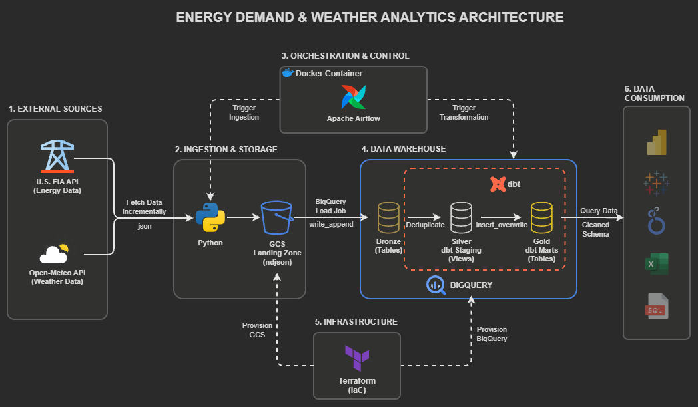
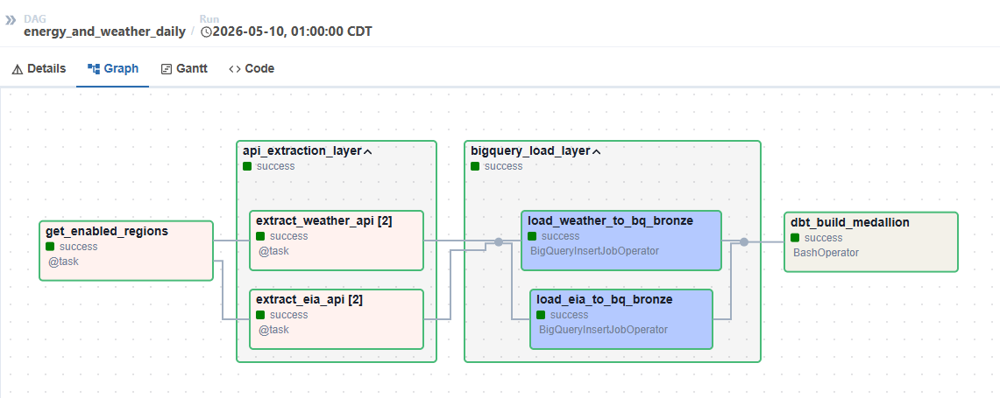
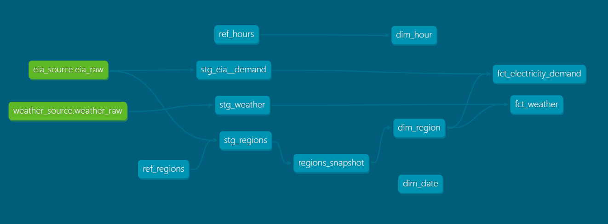
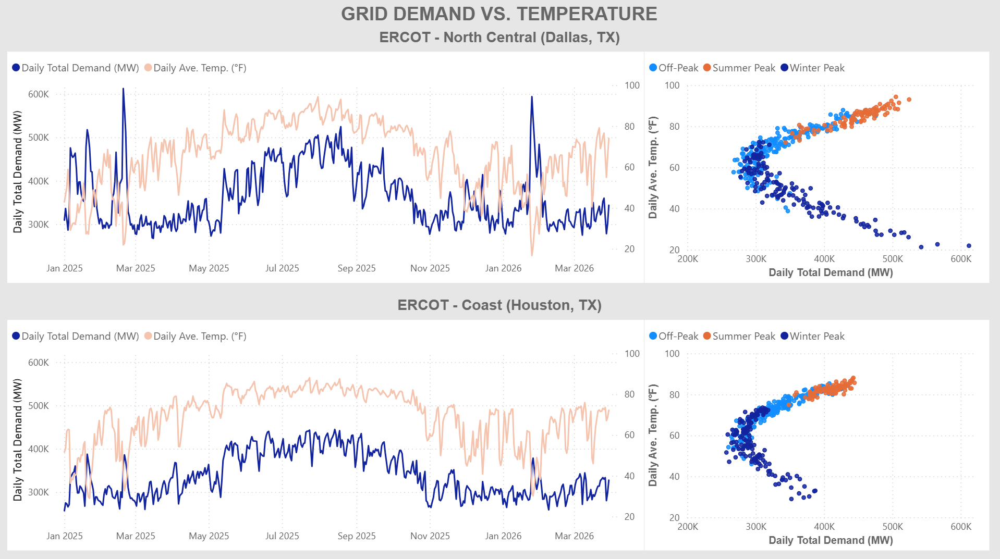

# Energy Demand & Weather Analytics Pipeline

## Project Overview
Energy demand fluctuates significantly based on weather conditions, seasonality, and regional usage patterns.
This project implements a scalable, Medallion-architecture pipeline that correlates regional energy consumption with weather telemetry. By transforming raw API data into analytics-ready Gold tables, the system provides the data foundation necessary for predictive load-shedding and cost optimization.

## Architecture & Design Decisions
### The High-Level Architecture Diagram

(This architecture diagram was created using [draw.io](https://www.drawio.com/))


### Tech Stack & Engineering Decisions
| Component | Selection | Engineering Logic |
| ------ | ----------- | - |
|**Data source** | [EIA](https://www.eia.gov/opendata/documentation.php) & [Open-Meteo](https://open-meteo.com/en/docs/historical-weather-api) APIs | **Multi-source integration**: Standardized disparate API schemas into a unified grain of one row per region per hour. |
|**Ingestion**|Python| **Portability**: Modular scripts fetch batch data incrementally; logic is kept in a dedicated directory for easy transition to serverless. |
|**Orchestration** | Apache Airflow| **Dependency Management**: Manages the strict transition from Ingestion $\rightarrow$ GCS $\rightarrow$ BigQuery $\rightarrow$ dbt. |
|**Containerisation** |Docker | **Environment Parity**: Airflow workers run in identical local/cloud environments to eliminate "works on my machine" issues. |
|**Infrastructure** | Terraform (IaC) | **Reproducibility**: Version-controlled state for GCS buckets and BigQuery datasets, ensuring 1-click stack deployment. |
|**Storage** | GCS| **Stateless Staging Zone**: Acts as a lightweight transit layer for raw JSON data; decouples ingestion from the warehouse while keeping cloud storage overhead to a minimum. |
|**Warehouse** | BigQuery | **Serverless Analytics**: Utilized for native partitioning and scalability; ensures queries remain fast and costs stay low as data grows. |
|**Transformation** |dbt | **Medallion Modeling**: Implements **Incremental** and **SCD Type 2** logic to track historical changes and minimize costs. |
| **Data Quality** | dbt test| **Multi-Layered Validation**: Enforces referential integrity and multi-column uniqueness constraints across the Star Schema.

## Project Structure
``` bash
.
├── ingestion/               # Modular Python scripts (executed within Airflow Docker workers)
│   ├── eia_ingest.py
│   ├── weather_ingest.py
│   └── regions.yaml         # Configuration for regional spatial mapping
├── orchestration/           # Dockerized Airflow environment
│   ├── dags/
│   │   └── eia_weather_dag.py
│   ├── Dockerfile           # Custom Airflow image with project dependencies
│   └── docker-compose.yml
├── infra/                   # Infrastructure as Code (IaC)
│   └── terraform/
│       ├── main.tf          # Provisions GCS buckets & BigQuery datasets
│       └── variables.tf
├── transformations/         # dbt project for Medallion architecture
│   ├── models/
│   │   ├── staging/         # Silver: Casting, column renaming, & UTC normalization
│   │   └── marts/           # Gold: Star Schema (Dimensions/Facts) & Integrated Joins
│   │       ├── dimensions/      # dim_date, dim_hour, dim_region
│   │       ├── facts/           # fct_electricity_demand, fct_weather
│   │       └── schema.yml       # Documentation and tests for the marts
│   ├── snapshots/           # SCD Type 2 logic for regional metadata
│   ├── seeds/               # Static reference data for hours and regions
│   └── dbt_project.yml
├── .gitignore
└── README.md
```


## Key Features & Engineering Challenges

### Cross-API Entity Resolution & Grain Alignment
Integrating the EIA API (Regional Demand) with the OpenMeteo API (Coordinate-based Weather) presented a "Dimension Gap." EIA uses Balancing Authority (BA) codes, while OpenMeteo requires latitude/longitude.
#### The Solution: Config-Driven Metadata Mapping

A `regions.yaml` config file is implemented as the "Source of Truth" for the pipeline. This allows the system to:
- **Bridge the Identity Gap**: Map EIA Region codes (e.g., NCEN) to specific central coordinates for weather polling.
- **Enforce Temporal Consistency**: Standardize all incoming data to UTC, ensuring that an energy surge at 5:00 PM matches the exact atmospheric conditions at that moment.
- **Enable Horizontal Scaling**: Adding a new region to the entire end-to-end pipeline (Ingestion $\rightarrow$ GCS $\rightarrow$ BigQuery) requires only a single line update in the config file, rather than code changes.


### Incremental Loading & Idempotent Backfills

The pipeline is designed to be **idempotent**, meaning it can be re-run for any historical period without creating duplicate records or data corruption.

- **Incremental Logic**: Utilizing Airflow’s `data_interval_end`, the ingestion and transformation layers only process data for the specific execution window.
- **Backfill Strategy**: I leveraged Airflow's CLI to perform a coordinated backfill of one year's worth of historical energy and weather data.
    ```bash
    airflow dags backfill \
        --start-date 2025-01-01 \
        --end-date 2026-04-03 \
        --task-regex "api_extraction_layer.*" \
        energy_and_weather_daily
    ```
- **Storage Strategy**: In BigQuery, I implemented a Partitioned Table strategy (partitioned by `day`). My dbt models use an insert_overwrite incremental strategy, which allows for efficient replacement of specific partitions during backfills without scanning the entire dataset.

### Monitoring & Data Quality

- Airflow provides orchestration visibility, retry handling, execution history, and task-level monitoring for ingestion workflows
- Python ingestion scripts log API request status, ingestion runtime, and row counts
- dbt tests validate uniqueness, non-null constraints, and referential integrity
- Incremental processing reduces duplicate ingestion and unnecessary reprocessing

### Data Modeling - Conformed Star Schema (Fact Constellation)


The core analytics layer is modeled using a **multi-fact star schema design** sharing **conformed dimensions**.

- **Fact 1**: `fct_electricity_demand` (Grain: Hourly / Region)
- **Fact 2**: `fct_weather` (Grain: Hourly / Coordinate-Region)
- **Conformed Dimension**: Both facts share `dim_date`, `dim_hour` and `dim_region`, enabling high-performance "Drill-Across" queries to analyze how temperature spikes correlate with grid load.

### Data Challenge: UTC Storage vs. Local Analysis
Pipelines spanning multiple timezones must store data in UTC to maintain a linear timeline and prevent data loss during Daylight Saving Time (DST) changes. However, energy analytics (like peak-hour grid load) are driven by local "wall-clock" time (e.g., consumer habits spike at 6 PM local time). Joining a raw UTC timestamp directly to standard Date and Hour dimensions breaks this business logic.
#### The Solution: "Shift-then-Join" Pattern
To bridge this gap while keeping the architecture lightweight, the transformation layer executes a localized key mapping strategy:
- **Dynamic IANA Timezone Lookups**: Joins raw ingestion data with regional metadata (`dim_region`) to fetch the exact IANA timezone string for each utility grid.
- **Local Key Extraction**: Leverages BigQuery’s `DATETIME(timestamp, timezone)` function to shift the UTC timeline to local wall-clock time, extracting the matching `date_key` and `hour_key` for the downstream Gold dimensions.
- **DST Safeguards**: Retains the original `timestamp_utc` as the unique grain constraint in the Fact table. This ensures the "Fall Back" 25-hour day handles both repeated local hours linearly without record collision or data erasure.
- **Multi-Timezone Scalability**: By abstracting the timezone conversion into dynamic lookups, the data model easily scales to accommodate new regions across any timezone without requiring code modifications to the core dbt transformations or dimension tables.

## Sample Insights
### Geographic Risk Profiling: Dallas vs. Houston
**Summer Cooling Load (Uniform Elasticity)**: Both ERCOT North Central (Dallas) and Coast (Houston) exhibit identical, highly linear demand-to-temperature synchronization during summer peaks. Above 80°F, air conditioning infrastructure drives massive, predictable grid load.

**Winter Heating Stress (Regional Divergence)**: During sub-freezing events (under 30°F), the North Central (Dallas) region experiences violent demand surges that rival its maximum summer peaks (stretching to 600K MW). Conversely, the Coast (Houston) exhibits a highly compressed, muted winter profile due to a milder maritime climate buffer.



## How to Run

1. Provision cloud infrastructure with Terraform 
2. Configure environment variables and credentials
3. Start the orchestration stack with Docker Compose
4. Trigger Airflow DAGs for ingestion and transformation

Detailed setup instructions are available in `setup.md`.
